# CUSTOMER_SEGMENTATION_Deep Learning (**90% Accuracy**)
To develop a deep learning model to predict the outcome of the campaign.

## ABOUT THE PROJECT

The dataset provided containing the details of marketing campaign done via phone with various details for customers. Therefore, the project request to help the bank to predict accurately whether the customer will subscribe to the focus product for the campaign (Whether Termed Deposit was subscribed or not post call).

## OBJECTIVE
1. To develop a deep learning model using TensorFlow which only comprises of Dense, Dropout, and Batch Normalization layers.
2. The **accuracy** of the model must be more than 70%.
3. Display the training loss and accuracy on TensorBoard.
4. Create modules (classes) for repeated functions to ease your training and testing process.

## REQUIREMENTS
1. PICKLE
2. NUMPY
3. PANDAS
4. MATPLOTLIB
5. SEABORN
6. SCIKIT LEARN
7. TENSORFLOW/TENSORBOARD

## PROJECT OVERVIEW
### EDA (EXPLORATORY DATA ANALYSIS)
1. Data Loading
- Importing dataset using os and read csv file using pandas.
2. Data Inspection

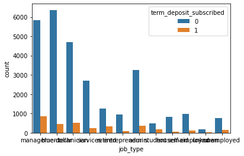
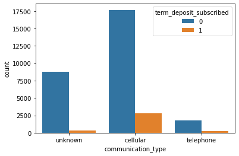
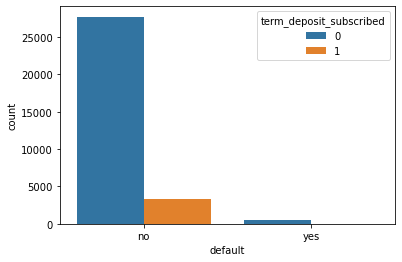
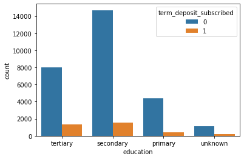
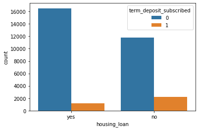
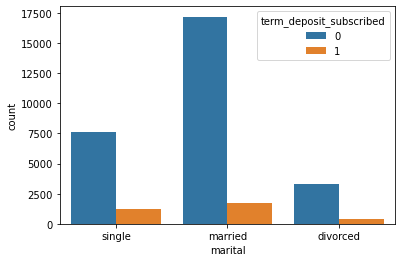
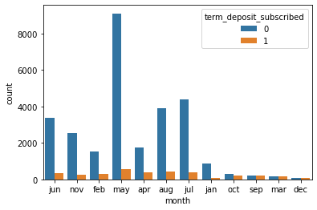
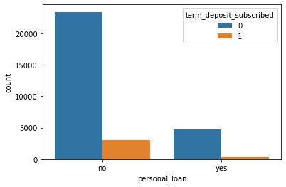

- Two columns removed from the dataset since the data is unnecessary which are id and prev_campaign_outcome columns.
- There are missing values and have no duplicates data.
- Categorical data present in str and needed to be encoded for the next step of analysis.
- Continuous and categorical data were analyzed against the target column, term_deposit_subscribed.

3. Data Cleaning

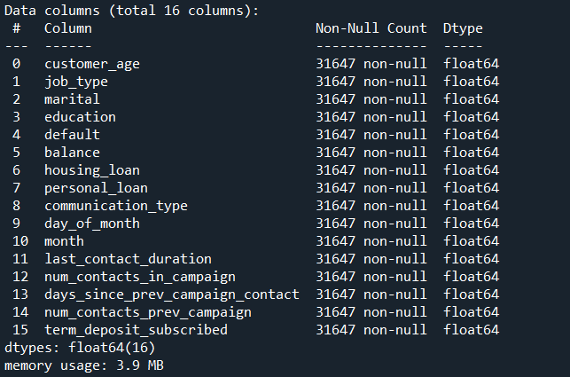
- Original dataset was copied to a new DataFrame.
- Missing values were check and handle using KNNImputer.
- No duplicates in the dataset.
- Unnecessary columns (id, prev_campaign_outcome) were dropped.
- Categorical data were encoded using LabelEncoder in order to handle the NaNs.
- Categorical datasets were ensured to have no decimal places and handled by using numpy (np.floor).

4. Features Selection

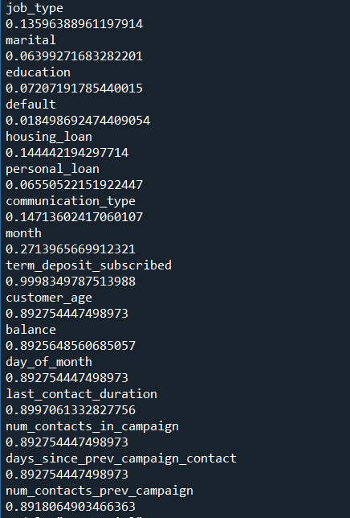
- Regression Analysis and Logistic Regression were deployed to find the correlation and accuracy of categorical and continuous dataset against target column, term_deposit_subscribed.

5. Data Preprocessing

- X was scaled using Scikit Learn (StandarScaler()), since most of high accuracy columns made of continuous data.
- Then, the scaled data was save in pickle file.
- Target column was encoded with OneHotEncoder and saved in pickle file.
- The X and y were splitted using train_test_plit.

### MODEL DEVELOPMENT

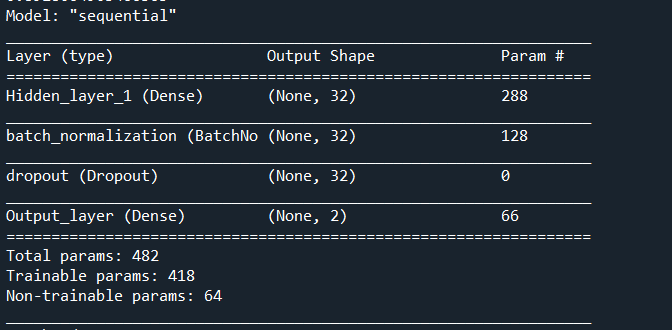
- Sequential approach was used for model development.
- Activation of sigmoid and loss = binary_crossentropy used as they work best for binary target output.
- EarlyStopping callback used to avoid overfitting
### MODEL TRAINING

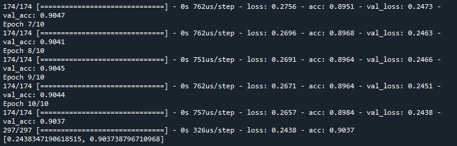
- Model was trained with batch_size = 128, and epochs = 10.
- The model achieved accuracy at 90% and loss 24%.

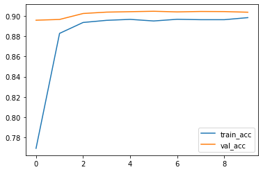
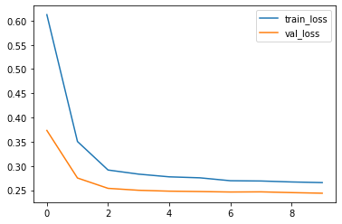
- Training and validation loss and accuracy were plotted.

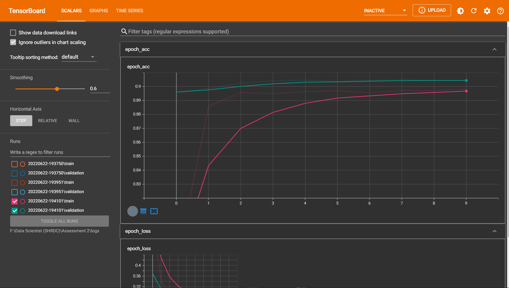
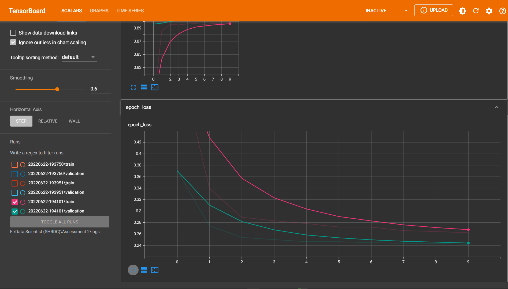
- The model also displayed in TensorBoard.

### MODEL EVALUATION

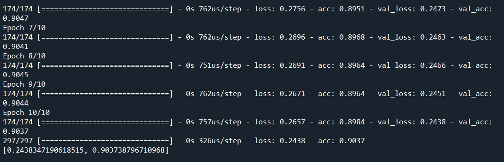
- Model evaluated and achieved accuracy at 90% and loss 24%.
- Then the model was saved in (.h5) file.
### DISCUSSION

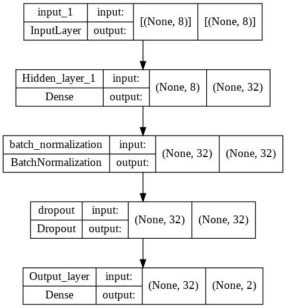
- Model architecture were plotted.
- The model shows that it able to train for accuracy at 90% with loss at 24%.
- Model accuracy can be improved by adding more hidden layers.

## CREDIT
The dataset obtain from: [HackerEarth HackLive: Customer Segmentation | Kaggle](https://www.kaggle.com/datasets/kunalgupta2616/hackerearth-customer-segmentation-hackathon)
